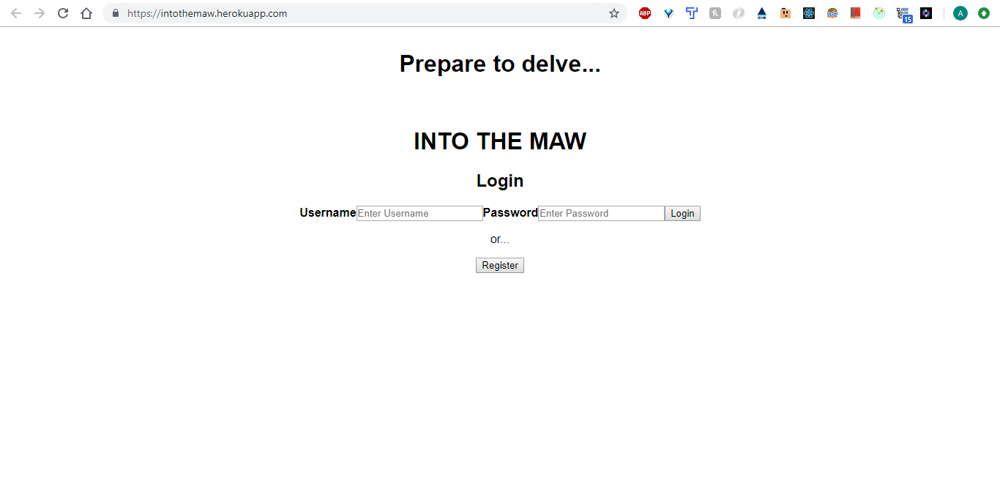

Into the Maw is an RPG where you explore into the Maw, a cave notorious for housing all manner of evil creatures. Allocate your stats, and battle using Rock, Paper, Scissors.  

## Screenshots
`Screenshots`

-A link to a deployed version
-- https://intothemaw.herokuapp.com/

-Link to the backend Heroku
--https://dashboard.heroku.com/apps/powerful-everglades-86438/settings

--and the backend repository.
--https://github.com/thinkful-ei22/Akim-React-Capstone-Backend

-The app uses a react/redux front end, and a Node/express backend

-The app component is the root component, followed directly in importance by the main-menu component, 
and the battle page component(which is in the src/components/battle folder.

